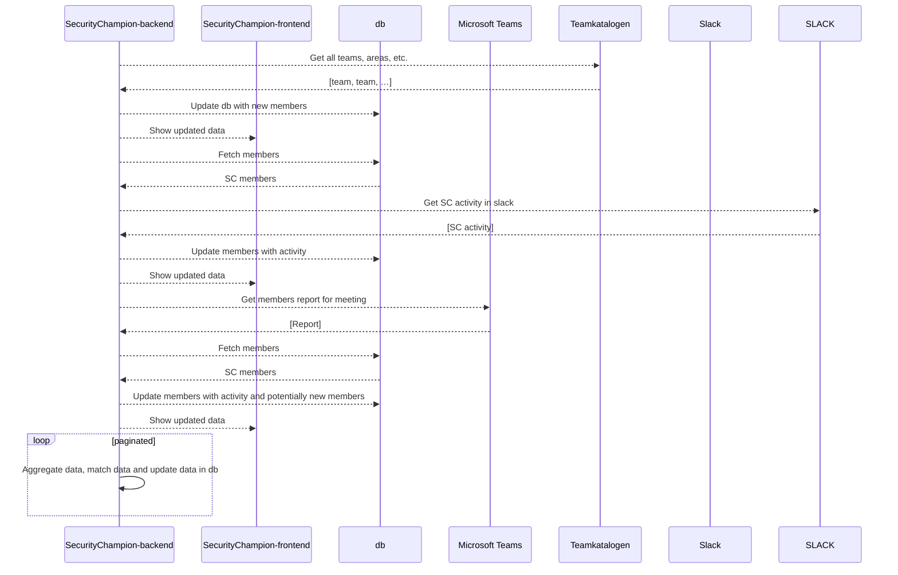

# Security Champion Stats

For oppfølging av Security Champions Stats.

## Hva gjør den?

## Hvordan kjører den?

### Flyt ([mermaid](https://github.blog/2022-02-14-include-diagrams-markdown-files-mermaid/) -syntaks)

### Konfigurasjon
No data for now
