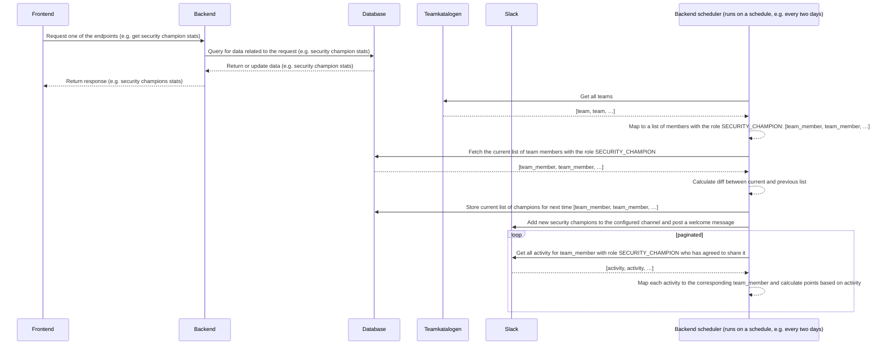

# Security Champion Stats backend application

## Overview
The backend application is built using Kotlin and Spring Boot, and it serves as the API for the frontend application.
It provides endpoints for fetching security champion statistics, managing security champions, and supporting the
Security Champion program over time. The backend application is responsible for handling business logic, data storage
and retrieval, and authentication and authorization for the frontend application.

The backend also includes a scheduled job that runs every two days. It syncs security champions, adds new security
champions to the Slack channel, and greets them with a welcome message.

### Data flow ([mermaid](https://github.blog/2022-02-14-include-diagrams-markdown-files-mermaid/) syntax)


## How to run
To run the backend application, follow these steps:
1. Make sure you have Java 17 or higher installed on your machine.
2. Start the local database: `docker compose up -d postgres`
3. Run the application with the local profile: `./gradlew bootRun --args='--spring.profiles.active=local'`
4. Mint a token for local calls: `curl -X POST http://localhost:8080/auth/local/token -H 'Content-Type: application/json' -d '{"navIdent":"Z12345","preferredUsername":"user@nav.no","groups":["local-admin-group"]}'`
5. Use the returned value as `Authorization: Bearer <token>` when calling `http://localhost:8080`.
6. To run tests, use the command: `./gradlew test`
7. Swagger API documentation is available at `http://localhost:8080/swagger-ui.html` (no authentication required in local profile).

In production, Swagger endpoints are protected with Basic Authentication. Configure credentials in `application.yaml`:
```yaml
swagger:
  username: admin
  password: your-secure-password
```
Access Swagger UI via browser at `http://localhost:8080/swagger-ui.html` and use the configured credentials when prompted.

This is best run together with the frontend application so you can see the data in the UI. To run the frontend
application, follow the instructions in `apps/frontend/Readme.md`.

## Technologies Used
- Kotlin: A modern programming language that runs on the JVM and is fully interoperable with Java
- Spring Boot: A framework for building production-ready applications with Java and Kotlin
- PostgreSQL: A powerful, open-source relational database management system
- Flyway: A database migration tool that helps manage and version control database schema changes
- JUnit: A testing framework for Java and Kotlin applications
- MockK: A mocking library for Kotlin
- Docker: A platform for developing, shipping, and running applications in containers

## Folder Structure
- `app/`: Contains the main application code, including the sync job and API controllers.
- `integrations/`: Contains integrations with external services (PostgreSQL, Slack, Teamkatalogen).
- `security/`: Contains authentication and authorization logic.
- `config/`: Contains application configuration classes.
- `utils/`: Contains shared utility functions.
- `src/test/`: Contains unit and integration tests for the application.
- `gradle/libs.versions.toml`: Contains version numbers for all dependencies used in the application, making it easier to manage and update them.

## Contributing
Contributions to the backend application are welcome! If you would like to contribute, please follow these steps:
1. Create a new branch for your feature or bug fix
2. Make your changes and commit them with descriptive commit messages.
3. Push your branch to the remote repository and create a pull request.
4. If you have any questions or need help, feel free to reach out to the appsec team!
