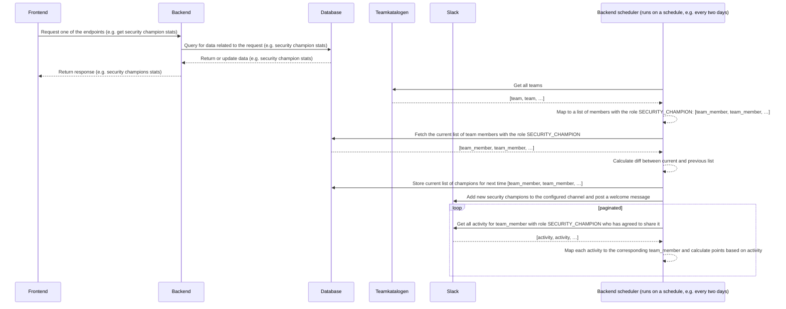

# Security Champion Stats backend application

## Overview
The backend application is built using Kotlin and Spring Boot, and it serves as the API for the frontend application.
It provides endpoints for fetching security champion statistics, managing security champions, and supporting the
Security Champion program over time. The backend application is responsible for handling business logic, data storage
and retrieval, and authentication and authorization for the frontend application.

The backend also includes a scheduled job that runs every two days. It syncs security champions, adds new security
champions to the Slack channel, and greets them with a welcome message.

### Data flow ([mermaid](https://github.blog/2022-02-14-include-diagrams-markdown-files-mermaid/) syntax)

```mermaid
sequenceDiagram
    participant FE as Frontend
    participant BE as Backend
    participant DB as Database
    participant TK as Teamkatalogen
    participant Slack as Slack
    participant BES as Backend scheduler (runs on a schedule, e.g. every two days)

    FE->>BE: Request one of the endpoints (e.g. get security champion stats)
    BE->>DB: Query for data related to the request (e.g. security champion stats)
    DB-->>BE: Return or update data (e.g. security champion stats)
    BE-->>FE: Return response (e.g. security champions stats)
    
    BES->>TK: Get all teams
    TK-->>BES: [team, team, …]
    BES-->>BES: Map to a list of members with the role SECURITY_CHAMPION: [team_member, team_member, …]
    BES->>DB: Fetch the current list of team members with the role SECURITY_CHAMPION
    DB-->>BES: [team_member, team_member, …]
    BES-->>BES: Calculate diff between current and previous list
    BES->>DB: Store current list of champions for next time [team_member, team_member, …]
    BES->>Slack: Add new security champions to the configured channel and post a welcome message
    loop paginated
        BES->>Slack: Get all activity for team_member with role SECURITY_CHAMPION who has agreed to share it
        Slack-->>BES: [activity, activity, …]
        BES-->>BES: Map each activity to the corresponding team_member and calculate points based on activity
    end    
```

## How to run
To run the backend application, follow these steps:
1. Make sure you have Java 17 or higher installed on your machine.
2. Start the local database: `docker compose up -d postgres`
3. Run the application with the local profile: `./gradlew bootRun --args='--spring.profiles.active=local'`
4. To run tests, use the command: `./gradlew test`
5. Swagger API documentation is available at `http://localhost:8080/swagger-ui.html` (no authentication required in local profile).

In production, Swagger endpoints are protected with Basic Authentication. Configure credentials in `application.yaml`:
```yaml
swagger:
  username: admin
  password: your-secure-password
```
Access Swagger UI via browser at `http://localhost:8080/swagger-ui.html` and use the configured credentials when prompted.

This is best run together with the frontend application so you can see the data in the UI. To run the frontend
application, follow the instructions in `apps/frontend/Readme.md`.

## Useful Commands

**View PostgreSQL logs (all statements):**
```shell
docker compose logs -f postgres
```
The database container is configured with `log_statement=all`, so every SQL query is logged to stderr and visible here.

**Connect to the local database (psql):**
```shell
docker exec -it postgres psql -U security -d security_champion_stats
```

**List tables and inspect data:**
```sql
\dt
SELECT * FROM member;
```

**Reset the database (wipe volume and restart):**
```shell
docker compose down -v && docker compose up -d postgres
```
Flyway will re-run all migrations on the next application startup.

**Run only a specific test class:**
```shell
./gradlew test --tests "navikt.appsec.securitychampionapp.*ClassName*"
```

## Technologies Used
- Kotlin: A modern programming language that runs on the JVM and is fully interoperable with Java
- Spring Boot: A framework for building production-ready applications with Java and Kotlin
- PostgreSQL: A powerful, open-source relational database management system
- Flyway: A database migration tool that helps manage and version control database schema changes
- JUnit: A testing framework for Java and Kotlin applications
- MockK: A mocking library for Kotlin
- Docker: A platform for developing, shipping, and running applications in containers

## Folder Structure
```
src/main/kotlin/.../
├── app/
│   ├── api/
│   │   ├── Controller.kt           # Public API endpoints (/api/*)
│   │   ├── AdminController.kt      # Admin-only endpoints (/api/admin/*)
│   │   └── dto/                    # Request/response DTOs
│   └── jobs/
│       ├── SyncJob.kt              # Daily sync: adds/removes champions from Teamkatalogen
│       ├── CalculatePointsJob.kt   # Daily job: calculates Slack activity points for all members
│       └── ResetPointsSyncJob.kt   # Scheduled job: resets all points and levels
├── config/                         # Spring configuration (Security, Swagger, Slack, TeamCatalog, Web)
├── integrations/
│   ├── postgress/                  # PostgreSQL repository, job lock, and DTOs
│   ├── slack/                      # Slack API service, activity and channel membership services
│   └── teamCatalog/                # Teamkatalogen client and DTOs
├── security/                       # Token introspection, auth filter, and principal DTOs
└── utils/
    └── Validate.kt                 # Input validation and level calculation

src/main/resources/
├── application.yaml                # Main configuration
├── application-local.yaml          # Local dev overrides (mocked integrations)
├── db/migration/                   # Flyway SQL migrations (V1–V6)
└── mock/                           # Static mock responses for Slack and Teamkatalogen (local profile)

gradle/libs.versions.toml           # Centralized dependency version catalog
```

### API Endpoints

**Public (`/api`)**
| Method | Path | Description |
|--------|------|-------------|
| GET | `/api/health` | Health check |
| GET | `/api/members` | List all active security champions |
| GET | `/api/validate` | Validate current user and return role info |
| GET | `/api/membership` | Fetch the authenticated user's membership details |
| POST | `/api/join` | Opt in to the security champion program |
| POST | `/api/leave` | Opt out of the security champion program |

**Admin (`/api/admin`)** — requires admin role
| Method | Path | Description |
|--------|------|-------------|
| POST | `/api/admin/member` | Manually add a member |
| DELETE | `/api/admin/member/{id}` | Delete a member |
| POST | `/api/admin/points` | Add points to a member |
| GET | `/api/admin/dashboard/members` | Get SC count over time |

### Scheduled Jobs
| Job | Schedule | Description |
|-----|----------|-------------|
| `SyncJob` | Daily at 12:00 | Syncs champions from Teamkatalogen, updates Slack user group, sends welcome messages |
| `CalculatePointsJob` | Daily at 13:00 | Fetches Slack activity and updates points/levels for all active members |
| `ResetPointsSyncJob` | Configurable via `jobs.reset-points.cron` | Resets all points and levels |

## Contributing
Contributions to the backend application are welcome! If you would like to contribute, please follow these steps:
1. Create a new branch for your feature or bug fix
2. Make your changes and commit them with descriptive commit messages.
3. Push your branch to the remote repository and create a pull request.
4. If you have any questions or need help, feel free to reach out to the appsec team!
