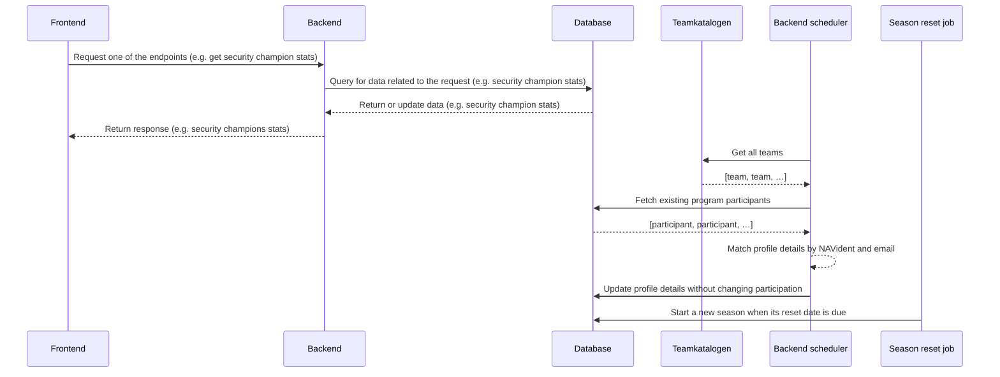

# Security Champion Stats backend application

## Overview
The backend application is built using Kotlin and Spring Boot, and it serves as the API for the frontend application.
It provides endpoints for fetching security champion statistics, managing security champions, and supporting the
Security Champion program over time. The backend application is responsible for handling business logic, data storage
and retrieval, and authentication and authorization for the frontend application.

Participation is managed in the application: employees can self-enroll, and administrators can manage
active status. Participants can leave voluntarily (`LEFT`) and self-rejoin without losing their history;
administrator deactivation cannot be reversed by self-enrollment. Activity credits require active participation
when the sync awards them. The scheduled Teamkatalogen sync refreshes profiles for existing participants without
creating, deactivating, or restoring participation.

Scores come from season-specific activity credits and signed administrator adjustments. Season resets
use Europe/Oslo dates and keep previous seasons intact; legacy point balances are not migrated.
Slack scoring awards one weekly credit for qualifying messages in the configured Security Champions channel.
The Slack adapter reads channel history and thread replies; test doubles exist only under `src/test`.
Sync maps unmapped authors automatically when their Slack profile email (`users.info`, needs `users:read.email`)
is a `@nav.no` address matching a participant's `nav_no_email`; administrators map the rest and review unmapped authors.
The admin dashboard reports season-wide activity metrics and persisted Slack/Delta sync health.
Administrators can trigger Slack and enabled Delta scoring syncs from the dashboard; they run in
the background and use the same locks as scheduled syncs.
The audit timeline starts at rollout with no historical backfill. `/api/admin/audit` provides a searchable,
paginated operational timeline; `/api/history` shows only the authenticated participant's membership and
scoring history. Operational entries expire after 12 months, while successful participant history remains
until permanent deletion. Audit writes are best-effort and do not change scoring outcomes.
Administrators choose eligible Delta categories and can add single owner-confirmed Delta event UUIDs.
Delta registration sync fetches past public events once per category (`GET /event?categories=<id>&onlyPast=true`)
and each single event (`GET /event/{id}`), keeps events that started this calendar year, and matches only
participant and host emails locally. Active program participants receive 1 point per eligible event, including hosts;
being listed in both rosters does not award extra credit. Removing a category keeps awarded credits.
The sync is disabled by default until Delta read access,
outbound network access, and eligible public event identifiers are confirmed. Administrators can inspect
its latest outcome at `/api/admin/delta/sync-status`.
Delta event import upserts all events in `DELTA_EVENTS_CATEGORY_ID` (default 54) into `Events`, keyed by the Delta
UUID and linked to `https://delta.nav.no/event/{id}`. It is disabled unless `DELTA_EVENTS_ENABLED=true`.
Playbook events are cached from `https://sikkerhet.nav.no/events.json` at startup and every six hours when
`PLAYBOOK_EVENTS_ENABLED=true` (enabled in Nais). Failed imports retain the previous snapshot.
`/api/events` hides `playbook:*` entries when a Delta or manual event starts on the same Europe/Oslo date;
`external:*` entries remain visible unless their Delta URL identifies an event already in our catalog.
Date-only feed events do not affect scoring.
Administrators can trigger an import with `POST /api/admin/playbook/events/sync`.
GitHub scoring awards 3 points per merged playbook PR or 1 per standalone default-branch commit,
strictly after enrollment and within the current season. It requires organization-level SAML identities
(`Members: read`) and `Contents: read` / `Pull requests: read` on `navikt/security-playbook`.
Set `GITHUB_APP_ID`, `GITHUB_APP_INSTALLATION_ID`, `GITHUB_APP_PRIVATE_KEY` (PEM), and
`GITHUB_SCORING_ENABLED=true`; it is disabled by default. The admin dashboard exposes sync health and
`POST /api/admin/github/sync` triggers a locked background sync. Missing or ambiguous SAML mappings never earn points.
Commit-to-PR lookups are batched; rate-limit failures stop the sync without immediate retry and show retry guidance.

### Data flow ([mermaid](https://github.blog/2022-02-14-include-diagrams-markdown-files-mermaid/) syntax)

```mermaid
sequenceDiagram
    participant FE as Frontend
    participant BE as Backend
    participant DB as Database
    participant TK as Teamkatalogen
    participant BES as Backend scheduler
    participant Season as Season reset job

    FE->>BE: Request one of the endpoints (e.g. get security champion stats)
    BE->>DB: Query for data related to the request (e.g. security champion stats)
    DB-->>BE: Return or update data (e.g. security champion stats)
    BE-->>FE: Return response (e.g. security champions stats)
    
    BES->>TK: Get all teams
    TK-->>BES: [team, team, …]
    BES->>DB: Fetch existing program participants
    DB-->>BES: [participant, participant, …]
    BES-->>BES: Match profile details by NAVident and email
    BES->>DB: Update profile details without changing participation
    Season->>DB: Start a new season when its reset date is due
```

## How to run
To run the backend application, follow these steps:
1. Make sure you have Java 25 installed on your machine.
2. Start the local database: `docker compose up -d postgres`
3. Run the application with the local profile: `./gradlew bootRun --args='--spring.profiles.active=local'`
4. To run tests, use the command: `./gradlew test`
5. Swagger API documentation is available at `http://localhost:8080/swagger-ui.html` (no authentication required in local profile).

Tests inherit the main configuration and apply `application-test.yaml` overrides.
`ApplicationStartupTest` boots the production profile with main configuration and Testcontainers PostgreSQL.
Scheduled Slack sync is disabled locally and in tests. Local manual sync uses real Slack access;
set `SLACK_TOKEN` and `SLACK_SC_CHANNEL_ID` to use it.

Swagger documentation is publicly accessible. In production, API operations require an Entra ID bearer token;
administrator access requires membership in the configured Entra group. Basic Authentication is not supported.
The non-local application will not start if `spring.security.token-validation.groups` is missing or blank.

This is best run together with the frontend application so you can see the data in the UI. To run the frontend
application, follow the instructions in `apps/frontend/Readme.md`.

## Useful Commands

**View PostgreSQL logs (all statements):**
```shell
docker compose logs -f postgres
```
The database container is configured with `log_statement=all`, so every SQL query is logged to stderr and visible here.

**Connect to the local database (psql):**
```shell
docker exec -it postgres psql -U security -d security_champion_stats
```

**List tables and inspect data:**
```sql
\dt
SELECT * FROM member;
```

**Reset the database (wipe volume and restart):**
```shell
docker compose down -v && docker compose up -d postgres
```
Flyway will re-run all migrations on the next application startup.

**Run only a specific test class:**
```shell
./gradlew test --tests "navikt.appsec.securitychampionapp.*ClassName*"
```

## Technologies Used
- Kotlin: A modern programming language that runs on the JVM and is fully interoperable with Java
- Spring Boot: A framework for building production-ready applications with Java and Kotlin
- PostgreSQL: A powerful, open-source relational database management system
- Flyway: A database migration tool that helps manage and version control database schema changes
- JUnit: A testing framework for Java and Kotlin applications
- MockK: A mocking library for Kotlin
- Docker: A platform for developing, shipping, and running applications in containers

## Folder Structure
```
src/main/kotlin/.../
├── app/
│   ├── api/
│   │   ├── Controller.kt           # Public API endpoints (/api/*)
│   │   ├── AdminController.kt      # Admin-only endpoints (/api/admin/*)
│   │   └── dto/                    # Request/response DTOs
│   ├── scoring/                    # Season scoring rules and application service
│   └── jobs/
│   ├── SyncJob.kt              # Daily sync: updates profiles for existing participants
│   ├── SlackScoringSyncJob.kt  # Fetches allowlisted Slack activity and awards weekly credits
│   └── ResetSeasonJob.kt       # Daily check for the next configured season start
├── config/                         # Spring configuration (Security, Swagger, Slack, TeamCatalog, Web)
├── integrations/
│   ├── postgress/                  # PostgreSQL repository, job lock, and DTOs
│   ├── delta/                      # Delta API client and registration roster DTOs
│   ├── slack/                      # Slack scoring history, thread-reply and user-email adapter
│   └── teamCatalog/                # Teamkatalogen client and DTOs
├── security/                       # Token introspection, auth filter, and principal DTOs
└── utils/
    └── Validate.kt                 # Input validation

src/main/resources/
├── application.yaml                # Main configuration
├── application-local.yaml          # Local dev overrides (mocked Teamkatalogen)
├── db/migration/                   # Flyway SQL migrations
└── mock/                           # Static Teamkatalogen responses (local profile)

gradle/libs.versions.toml           # Centralized dependency version catalog
```

### API Endpoints

**Public (`/api`)**
| Method | Path | Description |
|--------|------|-------------|
| GET | `/api/health` | Health check |
| GET | `/api/members` | List active participant names and teams |
| GET | `/api/validate` | Validate the current user and return participation status |
| GET | `/api/membership` | Fetch the authenticated user's participation details |
| POST | `/api/enroll` | Enroll the authenticated employee in the program |
| GET | `/api/recognition` | List positive-score names and ranks without points |
| GET | `/api/leaderboard` | Get exact scores for active participants and administrators |
| GET | `/api/scoring/me` | Get the active participant's current-season score, level, and rank (rank is null at zero points) |
| GET | `/api/history` | View the authenticated participant's membership and scoring history |

**Admin (`/api/admin`)** — requires admin role
| Method | Path | Description |
|--------|------|-------------|
| POST | `/api/admin/member` | Manually add a member |
| DELETE | `/api/admin/member/{id}` | Delete a member |
| GET | `/api/admin/participants` | List program participants |
| PUT | `/api/admin/participants/{id}/status` | Activate or deactivate a participant |
| DELETE | `/api/admin/participants/{id}` | Permanently delete a participant after confirmation |
| GET | `/api/admin/scoring` | Get the current season and participant scores |
| GET | `/api/admin/dashboard/overview` | Get aggregate program metrics and Slack/Delta sync health |
| GET | `/api/admin/scoring/participants/{id}/credits` | List a participant's activities for corrections |
| POST | `/api/admin/scoring/participants/{id}/adjustments` | Add a signed, reasoned point adjustment |
| PUT | `/api/admin/scoring/season/reset-date` | Set the next scheduled season start |
| POST | `/api/admin/scoring/season/reset` | Start a manually confirmed season |
| GET | `/api/admin/slack` | List approved Slack mappings and unmapped authors |
| POST | `/api/admin/slack/sync` | Trigger a Slack scoring sync |
| POST | `/api/admin/slack/mappings` | Explicitly map a Slack account to a participant |
| DELETE | `/api/admin/slack/mappings/{slackUserId}` | Remove a Slack account mapping |
| GET | `/api/admin/delta/event-mappings` | List explicit program-event-to-Delta UUID mappings |
| POST | `/api/admin/delta/event-mappings` | Add an explicit Delta event mapping |
| DELETE | `/api/admin/delta/event-mappings/{id}` | Remove a Delta mapping with no awarded credits |
| GET | `/api/admin/delta/categories` | List Delta categories |
| GET | `/api/admin/delta/eligible-categories` | List Delta categories that give points |
| POST | `/api/admin/delta/eligible-categories` | Make a Delta category eligible |
| DELETE | `/api/admin/delta/eligible-categories/{categoryId}` | Remove an eligible category, keeping credits |
| GET | `/api/admin/delta/sync-status` | View the latest Delta registration sync outcome |
| POST | `/api/admin/delta/sync` | Trigger an enabled Delta registration sync |
| POST | `/api/admin/delta/events/sync` | Trigger an enabled Delta event import |
| GET | `/api/admin/dashboard/members` | Get SC count over time |
| GET | `/api/admin/audit` | Search and paginate programme-wide operational audit events |

### Scheduled Jobs
| Job | Schedule | Description |
|-----|----------|-------------|
| `SyncJob` | Daily at 12:00 | Updates participant profiles from Teamkatalogen |
| `SlackScoringSyncJob` | Every 6 hours | Awards qualifying Slack participation credits and queues unmapped authors |
| `DeltaScoringSyncJob` | Every 6 hours | Awards registrations for started, current-year public events in eligible categories or single events; disabled by default |
| `DeltaEventImportJob` | Every 6 hours | Imports and updates Delta events in the configured category; disabled by default |
| `ResetSeasonJob` | Daily at 00:00 Europe/Oslo | Starts a new season when its configured date is due |

## Contributing
Contributions to the backend application are welcome! If you would like to contribute, please follow these steps:
1. Create a new branch for your feature or bug fix
2. Make your changes and commit them with descriptive commit messages.
3. Push your branch to the remote repository and create a pull request.
4. If you have any questions or need help, feel free to reach out to the appsec team!
